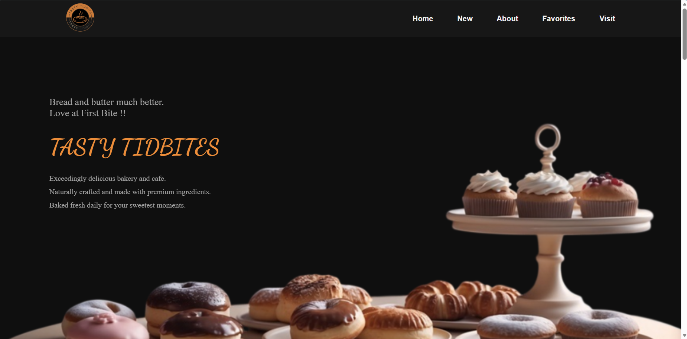
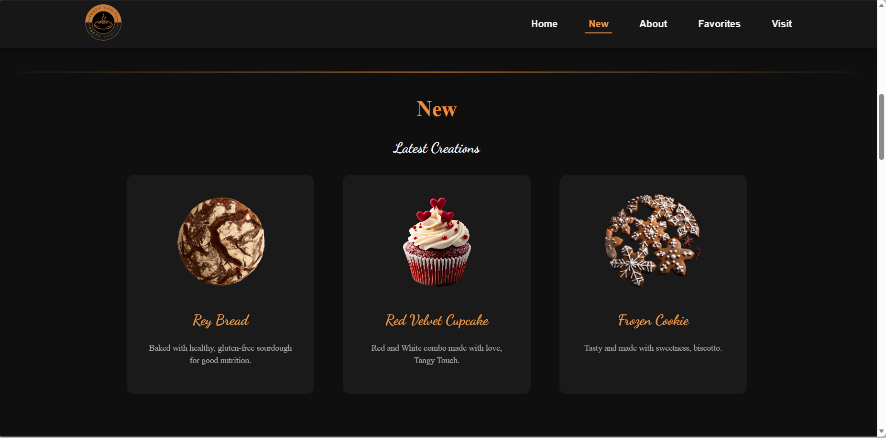
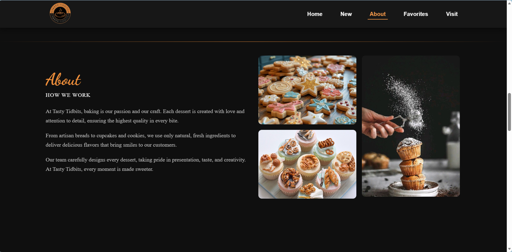
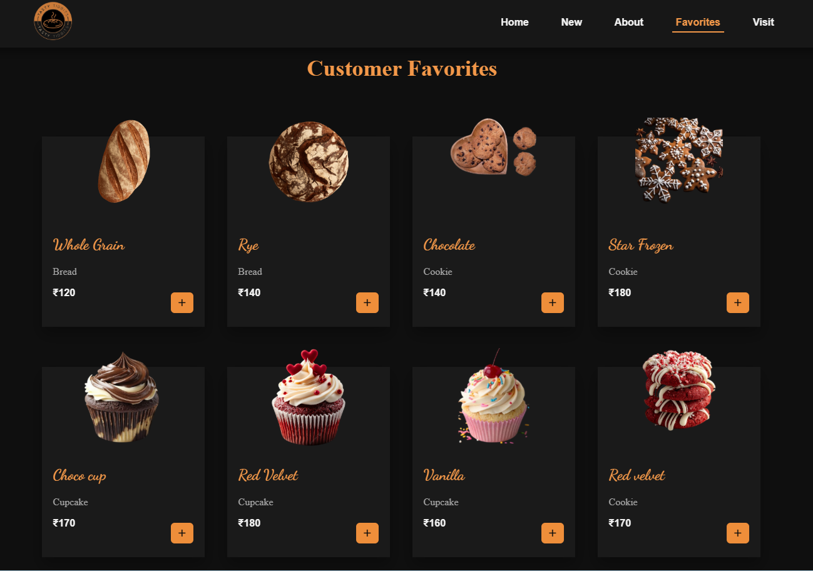
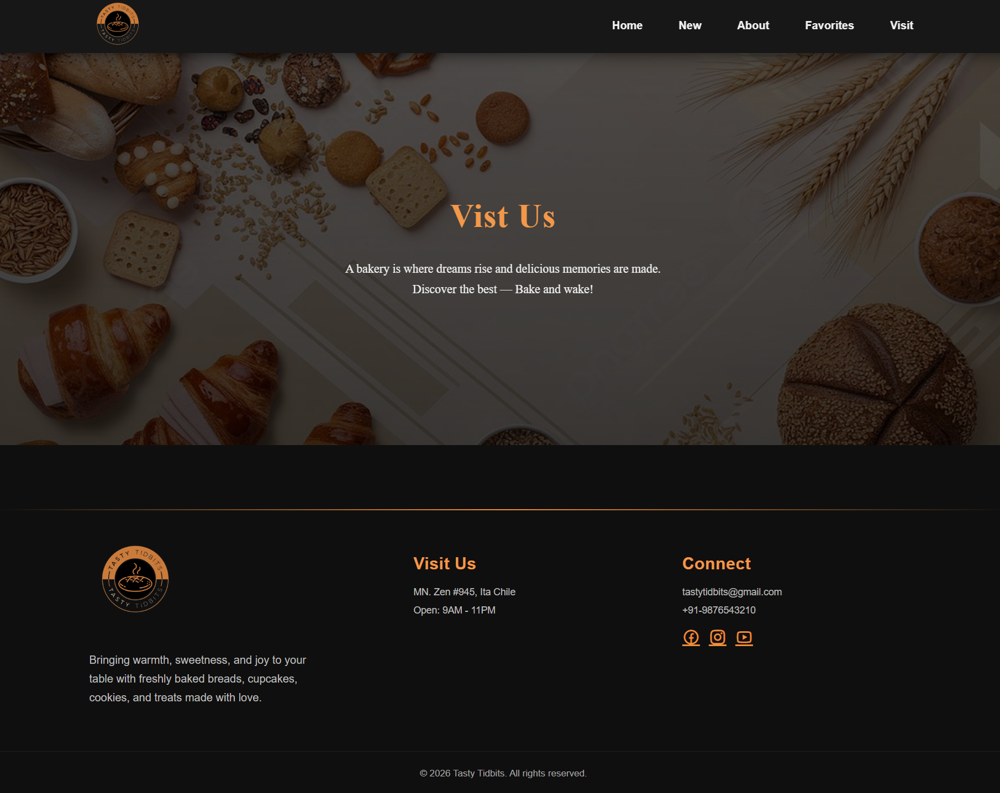

# 🥐 Bakery Website – React Frontend
📌 Overview

A fully responsive bakery website developed using React (Vite), implementing a modular component-based architecture.

The project demonstrates reusable components, structured state management, responsive layouts, and clean UI design aligned with modern frontend development standards.

## 🛠 Tech Stack
React (Vite)
JavaScript (ES6+)
HTML5
CSS3
ScrollReveal (for animations)
Git & GitHub

## 📂 Project Structure
```
bakery-react/
│
├── public/
│   └── img/
│
├── src/
│   ├── components/
│   │   ├── About.jsx
│   │   ├── Favorite.jsx
│   │   ├── Footer.jsx
│   │   ├── Home.jsx
│   │   ├── Menu.jsx
│   │   ├── New.jsx
│   │   └── Visit.jsx
│   │
│   ├── App.jsx
│   ├── main.jsx
│   └── style.css
│
├── index.html
├── package-lock.json
├── package.json
├── README.md
└── vite.config.js
```

## ✨ Features

-- Responsive design for mobile, tablet, and desktop
-- Component-based architecture
-- Clean and reusable UI sections
-- Scroll animations using ScrollReveal
-- Organized folder structure
-- Optimized asset handling via Vite

### ⚙️ Installation & Setup

### Clone the Repository
```bash
git clone https://github.com/maazfatima21/website-.git
```

### Navigate to the project folder
```bash
 cd repository-name
```

### Install dependencies
```bash
 npm install
```
### Run development server
```bash
 npm run dev
```

### Build for production
```bash
 npm run build
```

## 📸 Screenshots

### Home Page


### New Page


### About


### Favorites


### Visit pages



### 🚀 Live Demo

**link** : https://tastytidbites.vercel.app/